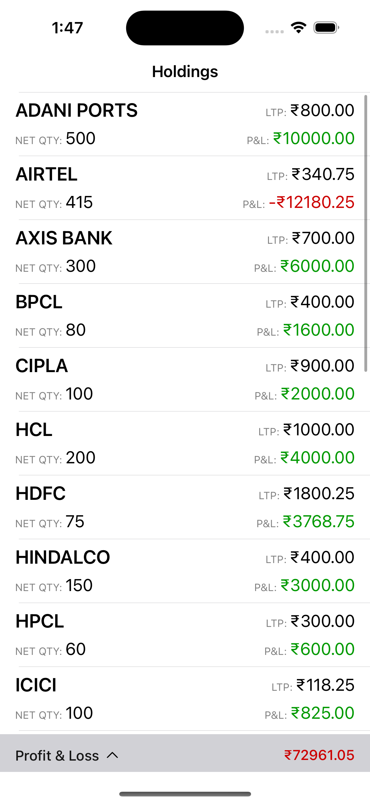
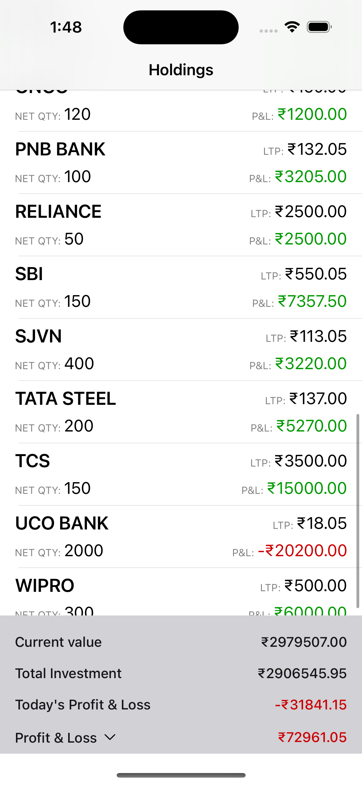
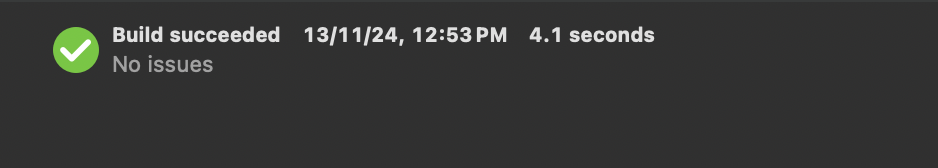
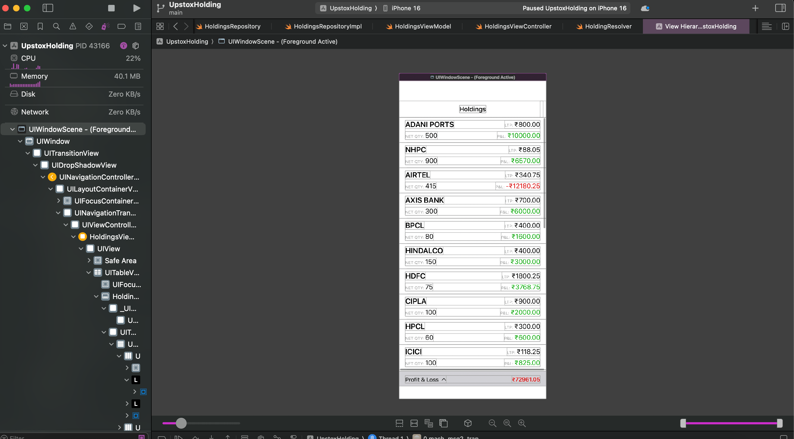

# Upstox iOS Assignment

User Holding App for upstox assignment

## Features

- Fetch real time data from API and display it to UI.
- Show UI as per requirement

## Tech stacks

- Swift
- UIKit
- Xcode

## Architecture
- CLEAN + MVVM +R (I have used MVVM+R architecture in presentation layer)

## Screenshots & Demo

- [App Demo!](./Media/demo.mp4)

  

## Build
- Build succeeded with no errors and warning

- No Layout constraints issue

## Unit Testing
**I have written unit test cases for all the business logic, achieving 100% code coverage.**

- Test case build succeeded with no errors and warning

- All test case passed

- Full app code coverage - 89%, where business logic code coverage - 100%

## Author

- [@Pritesh Singhvi](https://github.com/narpat22) 🙋‍♂️
- [LinkedIn](https://www.linkedin.com/in/priteshsinghvi/)